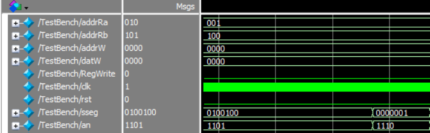
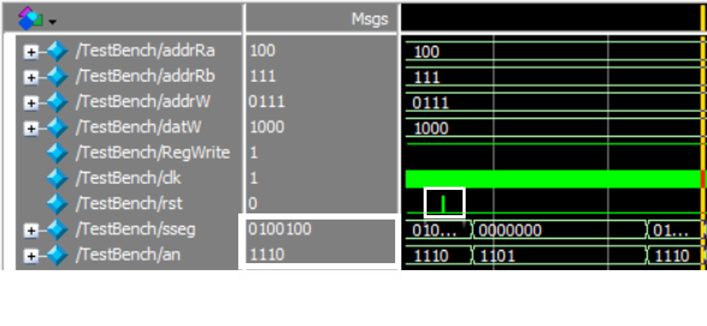

# lab04 Diseño de banco de Registro
## Integrantes
* Nicol Dayana Cruz Orjuela
* Javier Santiago Giraldo Jiménez
* Valentina Quiroga Gonzalez
## Desarrollo
Se busca un banco de registros implementado en la FPGA.
El trabajo del grupo consiste en crear un archivo tipo ¨Top¨ que permita integrar los archivos previamente dados en el paquete de trabajo que permitan hacer la implementación en forma de lenguaje de descripción de Hardware. Se instancian tanto el banco de registros como el display. Adicionalmente se muestran los resultados del diseño tanto por TestBench.


### Código del banco de registro

```verilog
module BancoRegistro #(      		 //   #( Parametros
         parameter BIT_ADDR = 3,  //   BIT_ADDR Número de bit para la dirección
         parameter BIT_DATO = 4  //  BIT_DATO  Número de bit para el dato
	)
	(
    // Entradas y salidas
    // Direcciones de registro
    input [BIT_ADDR-1:0] addrRa,
    input [BIT_ADDR-1:0] addrRb,
    // Dato de salida
    output [BIT_DATO-1:0] datOutRa,
    output [BIT_DATO-1:0] datOutRb,

    input [BIT_ADDR:0] addrW, // Dirección de escritura
    input [BIT_DATO-1:0] datW, // Dato de entrada

    input RegWrite, // Control de escritura del banco
    input clk,
    input rst // Botón de reset- reinicio, el banco vuelve a su estado por default
    );

// La cantdiad de registros es igual a:
localparam NREG = 2 ** BIT_ADDR;
localparam datRST=1; // Dato guardado por defecto

// Configuración del banco de registro
reg [BIT_DATO-1: 0] breg [NREG-1:0];
reg [BIT_DATO-1: 0] save [NREG-1:0];

assign  datOutRa = breg[addrRa];
assign  datOutRb = breg[addrRb];
integer i;

initial begin // Lectura inicial de datos de un archivo externo--Precarga del archivo
	$readmemh("D:/Users/jsgj2/Documents/GitHub/lab04-2021-2-grupo01-2021-2/Lab04/Reg.txt",breg);
	$readmemh("D:/Users/jsgj2/Documents/GitHub/lab04-2021-2-grupo01-2021-2/Lab04/Reg.txt",save);
end

always @(posedge clk) begin
	if(rst==1) // Verifica estado de reset
	for(i=0; i<NREG;i=i+1) begin
		breg[i] <= save[i]; // Asigna el valor por defecto
	end
	else if (RegWrite == 1) // Verifica el enable de registro
		breg[addrW] <= datW; // Asigna el dato
end
endmodule
```
Al inicio del código se parametriza el tamaño y la cantidad de registros.
El control de escritura es implementado como un enable para que se registre el dato en la dirección dada.

### Código top
```verilog
module Lab04(
  // Entradas y salidas
	output [0:6] sseg,
	output [3:0] an,
	input [3:0] addrRa,
	input [3:0] addrRb,
	input [3:0] addrW,
	input [3:0] datW,
	input RegWrite,
	input clk,
	input rst);
	// Conexión entre el banco de registro y el display
	wire [3:0] datOutRa;
	wire [3:0] datOutRb;
	// Instanciaciones
	BancoRegistro banco(.addrRa(addrRa),.addrRb(addrRb),.datOutRa(datOutRa),.datOutRb(datOutRb),.addrW(addrW),.datW(datW),.RegWrite(RegWrite),.clk(clk),.rst(rst));//banco de registro
	display display(.numA(datOutRa),.numB(datOutRb),.clk(clk),.sseg(sseg),.an(an),.rst(rst));//display

endmodule
```
## TestBench: Resultados en simulación

Para poner a prueba el banco de datos se tiene:

```verilog
module TestBench;

	// Registros
	reg [2:0] addrRa;
	reg [2:0] addrRb;
	reg [3:0] addrW;
	reg [3:0] datW;
	reg RegWrite;
	reg clk;
	reg rst;


	wire [0:6] sseg;
	wire [3:0] an;
	integer i;

	// Outputs
	wire [0:6] datOutRa;
	wire [3:0] datOutRb;

	// Instantiate the Unit Under Test (UUT)
	Lab04 uut (
		.addrRa(addrRa),
		.addrRb(addrRb),
		.addrW(addrW),
		.datW(datW),
		.RegWrite(RegWrite),
		.clk(clk),
		.rst(rst),
		.sseg(sseg),
		.an(an)
	);
	initial begin
		// Initialize Inputs
		addrRa = 0;
		addrRb = 0;
		addrW = 0;
		datW = 0;
		RegWrite = 0;
		clk = 0;
		rst = 0;

		/// Wait 100 ns for global reset to finish
		#100;

    		for (addrRa = 0; addrRa < 4; addrRa = addrRa + 1) begin
		//Lectura registros
			#5000 addrRb=addrRa+4;
		end

		// Escritura
		#5000
		// Se activa la escritura
		RegWrite=1;
		// Se indica la direccion de escritura
		addrW=7;
		for(i=0; i<9;i=i+1) begin
		  #5000 datW=i;
		end

	 	// Reset
		#1000
		rst=1;
		#25;
		rst=0;
		#25;

	 end

	 always #1 clk = ~clk;

endmodule
```
Para el estudio de resultados se tiene que:
* Lectura: Se observa el inicio del TestBench la salida de cada display.
  - Para el caso del display 1110 se tiene que el dato almacenado pasando del 7seg es 0.
  - Para el caso del display 1101 se tiene que el dato almacenado pasando del 7seg es 5.




* Escritura: Se observa el resultado cuando _i_ cambia de valor.
Enfocados en el valor que aparece en _sseg_ cuando _i_ tiene valores de 2 y 3, observando el cambio de dato que hay.


* Reset: Se observa que en el pequeño pulso de _reset_ los valores vuelven a como se determinaron en un incio. Se señala que en el display 1110 Se tiene el mismo valor que se observó al inicio de la prueba.


